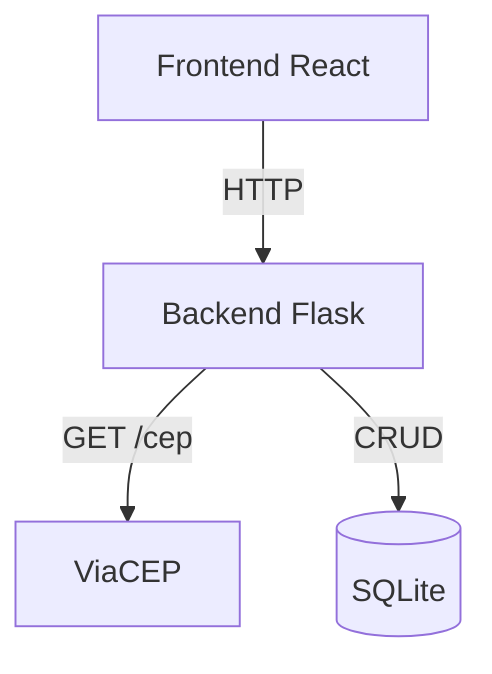
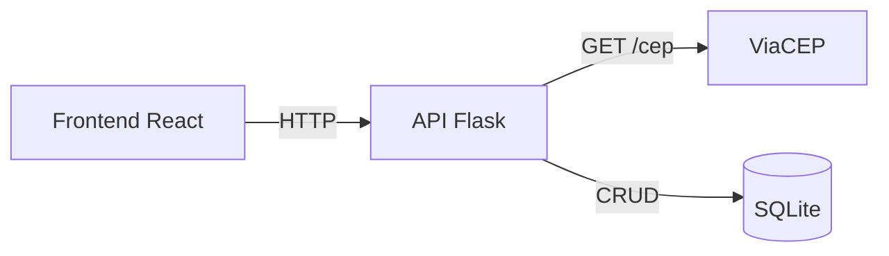
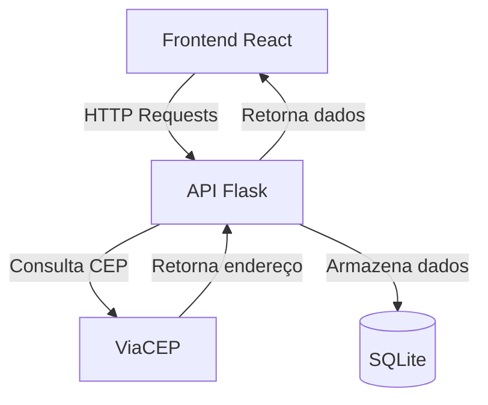
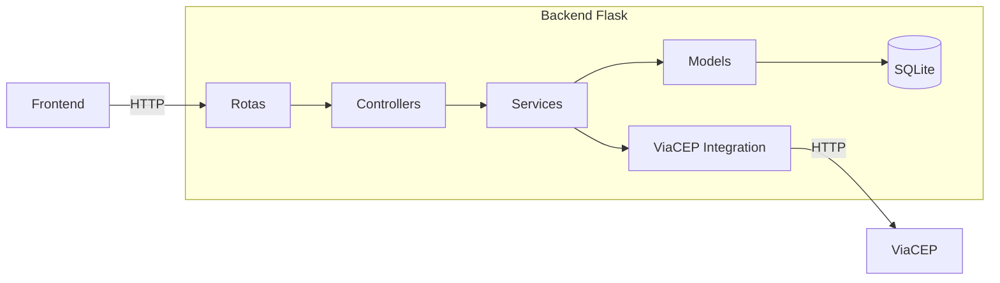

# 🧓 Sistema de Cadastro de Idosos

## 📋 Descrição
Sistema completo para cadastro e gerenciamento de idosos com:
- 🖥️ **Frontend** em React
- ⚙️ **Backend** em Flask
- 📦 **Persistência** em SQLite
- 🌐 **Integração** com ViaCEP (API externa)

## 🏗️ Arquitetura

### Conexões:

Frontend → Backend (HTTP Requests)
Backend → ViaCEP (GET /cep)
Backend → SQLite (CRUD)
ViaCEP → Backend (JSON response)

🚀 Começando

📦 Pré-requisitos
Node.js 16+

Python 3.9+

Docker (opcional)

### Instalação Local

Frontend (React)

git clone https://github.com/elisangeladias/frontend-idosos.git

cd frontend-idosos

npm install

Configure o arquivo .env:

REACT_APP_API_URL=http://localhost:5000

Inicie a aplicação:

npm start

Backend (Flask)

git clone https://github.com/elisangeladias/backend-idosos.git

cd backend-idosos

python -m venv venv

# Linux/Mac:
source venv/bin/activate

# Windows:
.\venv\Scripts\activate

pip install -r requirements.txt

Inicie a API:
python app.py

### 🐳 Execução com Docker

Frontend

docker build -t frontend-idosos .

docker run -p 3000:3000 frontend-idosos

Backend

docker build -t backend-idosos .

docker run -p 5000:5000 backend-idosos

### Docker Compose (recomendado)

Crie docker-compose.yml:

version: '3'

services:

  frontend:
  
    build: ./frontend
    
    ports:
    
      - "3000:3000"
      
    depends_on:
    
      - backend
      
  backend:
  
    build: ./backend
    
    ports:
    
      - "5000:5000"
      
Execute:

docker-compose up --build

### 📡 Rotas da API

Método	Endpoint	Descrição

GET	    /idosos	  Lista todos os idosos

POST	  /idosos	  Cria novo cadastro

PUT	   /idosos/{id} Atualiza cadastro

DELETE	/idosos/{id} Remove cadastro

GET	    /cep/{cep}	Consulta ViaCEP

### 🌍 API Externa

ViaCEP - Serviço gratuito de consulta de CEPs

Licença: Uso gratuito (não requer autenticação)

🔗 Documentação: https://viacep.com.br

Exemplo de uso: GET https://viacep.com.br/ws/01001000/json/

### 🛠️ Estrutura dos Projetos

frontend-idosos/
├── public/
├── src/
├── Dockerfile
└── package.json

backend-idosos/
├── app.py
├── requirements.txt
└── Dockerfile
