# 🧓 Sistema de Cadastro de Idosos

### Antes de Tudo

Antes de começar, certifique-se de instalar o Docker, o Python e todas as demais bibliotecas necessárias em seu computador. Você também precisará de um editor de código de sua preferência, como Visual Studio Code ou outros. Para aqueles que optarem por desenvolver uma interface para usuários e se for fazer uso de biblioteca de componentes (React, Next, Vue, etc) certifiquem-se de instalar o Node.js e as dependências necessárias para o desenvolvimento dessa interface.

Link para instalação do Docker nos sistemas:

● Windows: https://docs.docker.com/desktop/install/windows-install/

● Ubuntu: https://docs.docker.com/engine/install/ubuntu/

● Mac OS: https://docs.docker.com/desktop/install/mac-install/

Observação: usuários de windows, é importante verificar se a virtualização de sua máquina está ativada na BIOS de sua máquina, pois ela é fundamental para habilitação do WSL2. Em seguida, você deve seguir os passos de instalação e habilitação do WSL2, para execução do Docker.

## 📋 Descrição
Sistema completo para cadastro e gerenciamento de idosos com:
- 🖥️ **Frontend** em React
- ⚙️ **Backend** em Flask
- 📦 **Persistência** em SQLite
- 🌐 **Integração** com ViaCEP (API externa)

## 🏗️ Arquitetura

```mermaid
graph TD
    A[Frontend React] -->|HTTP Requests| B[API Flask]
    B -->|Consulta CEP| C[ViaCEP]
    B -->|Armazena dados| D[(SQLite)]
    C -->|Retorna endereço| B
    B -->|Retorna dados| A
```

### Conexões:

Frontend → Backend (HTTP Requests)
Backend → ViaCEP (GET /cep)
Backend → SQLite (CRUD)
ViaCEP → Backend (JSON response)

🚀 Começando

📦 Pré-requisitos
Node.js 16+

Python 3.9+

Docker (opcional)

### Instalação Local

Frontend (React)

git clone https://github.com/elisangeladias/frontend-idosos.git

cd frontend-idosos

npm install

Configure o arquivo .env:

REACT_APP_API_URL=http://localhost:5000

Inicie a aplicação:

npm start

Backend (Flask)

git clone https://github.com/elisangeladias/backend-idosos.git

cd backend-idosos

python -m venv venv

# Linux/Mac:
source venv/bin/activate

# Windows:
.\venv\Scripts\activate

pip install -r requirements.txt

Inicie a API:
python app.py

### 🐳 Execução com Docker

Frontend

docker build -t frontend-idosos .

docker run -p 3000:3000 frontend-idosos

Backend

docker build -t backend-idosos .

docker run -p 5000:5000 backend-idosos

### Docker Compose (recomendado)

Crie docker-compose.yml:

version: '3'

services:

  frontend:
  
    build: ./frontend
    
    ports:
    
      - "3000:3000"
      
    depends_on:
    
      - backend
      
  backend:
  
    build: ./backend
    
    ports:
    
      - "5000:5000"
      
Execute:

docker-compose up --build

### 📡 Rotas da API

Método	Endpoint	Descrição

GET	    /idosos	  Lista todos os idosos

POST	  /idosos	  Cria novo cadastro

PUT	   /idosos/{id} Atualiza cadastro

DELETE	/idosos/{id} Remove cadastro

### 🌍 API Externa

ViaCEP - Serviço gratuito de consulta de CEPs

Licença: Uso gratuito (não requer autenticação)

🔗 Documentação: https://viacep.com.br

Exemplo de uso: GET https://viacep.com.br/ws/01001000/json/

### 🛠️ Estrutura dos Projetos

frontend-idosos/
├── public/
├── src/
├── Dockerfile
└── package.json

backend-idosos/
├── app.py
├── requirements.txt
└── Dockerfile
